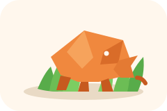
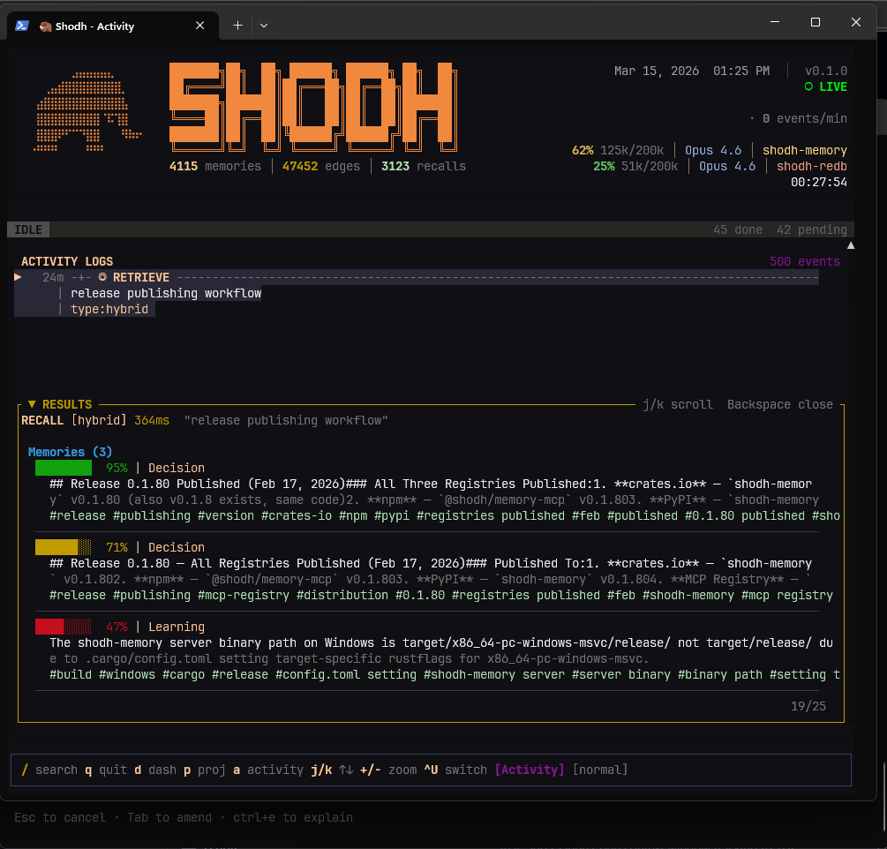
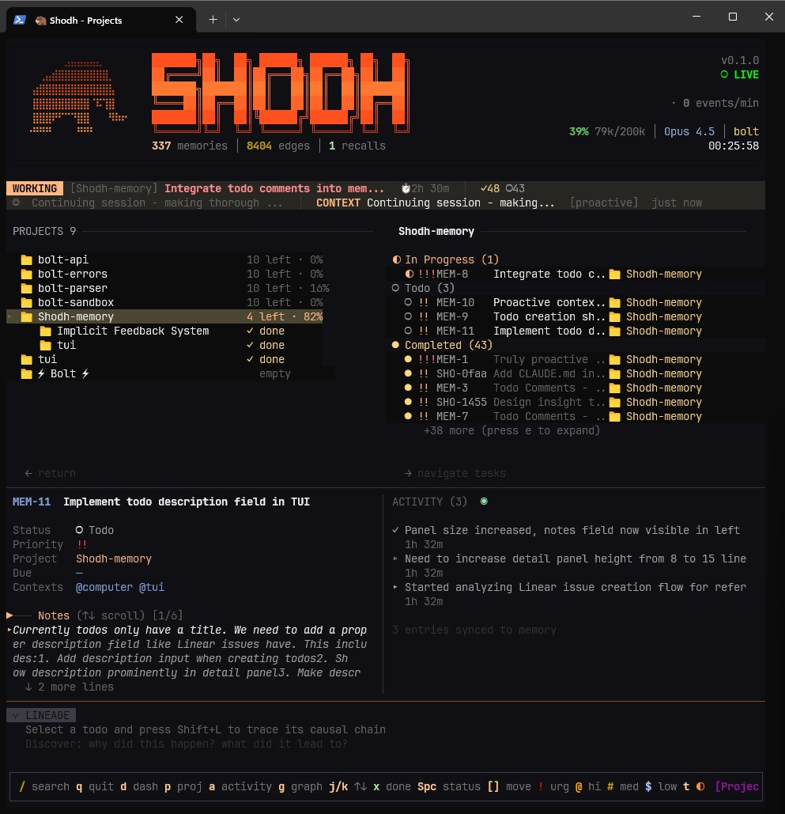

<p align="center">
  
</p>

<h1 align="center">Veld - Agentic Memory</h1>

<p align="center"><b>Persistent cognitive memory for AI agents and robots. Remembers what matters, forgets what doesn't, gets smarter with use.</b></p>

<p align="center">
  <a href="https://github.com/Portll/veld"></a>
  <a href="https://registry.modelcontextprotocol.io/v0/servers?search=shodh"></a>
  <a href="https://cursor.directory/plugins/shodh-memory-1"></a>
  <a href="https://crates.io/crates/shodh-memory"></a>
  <a href="https://www.npmjs.com/package/@shodh/memory-mcp"></a>
  <a href="https://pypi.org/project/shodh-memory/"></a>
  <a href="https://hub.docker.com/r/varunshodh/shodh-memory"></a>
  <a href="LICENSE.MD"></a>
  <a href="https://discord.gg/HrpzXqTtEp"></a>
</p>

---

<p align="center">
  
</p>

AI agents forget everything between sessions. Robots lose context between missions. They repeat mistakes, miss patterns, and treat every interaction like the first one.

Veld - Agentic Memory fixes this. It's persistent memory that actually learns — memories you use often become easier to find, old irrelevant context fades automatically, and recalling one thing brings back related things. Works for chat agents (MCP/HTTP), robots (Zenoh/ROS2), and edge devices. No API keys. No cloud. No external databases. One binary.

`Veld - Agentic Memory` is the product name. The branch-tip binaries here are `veld` (unified CLI) and `meerkat` (thin standalone server). Current published package IDs still use `shodh-memory` and `@shodh/memory-mcp` while registry surfaces catch up.

> Branch status: this repository is currently tracked as `v0.7.7-unstable`.
> It is being cleaned and stabilized toward a clean `v0.8` cut before the later
> `v0.9` public-release work. Treat the branch tip as internal/unstable unless a
> tagged release says otherwise.
>
> Local macOS builds on this branch should use `./scripts/cargo-dev.sh ...` from
> the repo root so Cargo inherits the current `libclang.dylib` workaround needed
> by the RocksDB build path.

## How Veld Compares

| Product | What it is | Deployment | Learns from usage | Best fit |
|---|---|---|---|---|
| **Veld** | Local-first agentic memory runtime | Single binary + local models | **Yes**: Hebbian learning, decay, replay | Agents, robotics, offline systems |
| **Mem0** | Managed memory layer | Cloud API and hosted services | LLM-assisted memory workflows | Cloud-managed app memory |
| **Cognee** | Knowledge graph extraction stack | Neo4j + vector DB + LLM stack | Graph construction and retrieval | Graph-heavy ETL and knowledge workflows |
| **Pinecone** | Hosted vector database | Cloud service | No memory runtime behavior | Managed vector infrastructure at scale |
| **Zep** | Hosted conversational memory service | Cloud service | Session and conversation memory | SaaS chat memory |

Veld is strongest when memory has to stay local, adaptive, and operationally simple. Mem0 is better when you want managed cloud memory workflows. Cognee is better when the main job is graph-heavy extraction. Pinecone is better when you need hosted vector infra. Zep is better when you want a hosted conversational memory service. The key distinction is that Veld is a memory runtime, not just storage or orchestration.

## Get Started

These install commands target the last tagged public artifacts. If you are working
from the checked-out `v0.7.7-unstable` branch, treat the repo as an internal
stabilization tree and prefer the repo-local development docs and wrappers.

### Build From Source (Branch Tip)

If you intentionally want this branch rather than the last tagged release
artifacts, build and run from the repo checkout instead of using Homebrew or the
published package registries.

```bash
# Build the current branch tip with the repo-local wrapper
./scripts/cargo-dev.sh build --release

# Run the unified CLI directly from the checkout
./target/release/veld init
./target/release/veld server
./target/release/veld tui
```

For repo-local MCP work on this branch:

```bash
cd mcp-server
bun install
bun run build
node dist/index.js
```

### Unified CLI

```bash
# Download from GitHub Releases (or, for the last public release line only, brew tap varun29ankuS/shodh-memory && brew install shodh-memory)
veld init        # First-time setup — creates config, generates API key, downloads AI model
veld server      # Start the memory server on :3030
veld tui         # Launch the TUI dashboard
veld status      # Check server health
veld doctor      # Diagnose issues
```

One binary, all functionality. No Docker, no API keys, no external dependencies.

### Claude Code (one command)

```bash
claude mcp add shodh-memory -- npx -y @shodh/memory-mcp
```

That's it. The MCP server auto-downloads the backend binary and starts it. No Docker, no API keys, no configuration. Claude now has persistent memory across sessions.

<details>
<summary>Or with Docker (for production / shared servers)</summary>

```bash
# 1. Start the server
docker run -d -p 3030:3030 -v shodh-data:/data varunshodh/shodh-memory

# 2. Add to Claude Code
claude mcp add shodh-memory -- npx -y @shodh/memory-mcp
```
</details>

<details>
<summary>Cursor / Claude Desktop config</summary>

```json
{
  "mcpServers": {
    "shodh-memory": {
      "command": "npx",
      "args": ["-y", "@shodh/memory-mcp"]
    }
  }
}
```

For local use, no API key is needed — one is generated automatically. For remote servers, add `"env": { "SHODH_API_KEY": "your-key" }`.
</details>

### Python

```bash
# Last published package surface, not this unstable branch tip
pip install shodh-memory
```

```python
from shodh_memory import Memory

memory = Memory(storage_path="./my_data")
memory.remember("User prefers dark mode", memory_type="Decision")
results = memory.recall("user preferences", limit=5)
```

### Rust

```toml
[dependencies]
# Last published crate surface, not this unstable branch tip
shodh-memory = "0.1"
```

```rust
use shodh_memory::{MemorySystem, MemoryConfig};

let memory = MemorySystem::new(MemoryConfig::default())?;
memory.remember("user-1", "User prefers dark mode", MemoryType::Decision, vec![])?;
let results = memory.recall("user-1", "user preferences", 5)?;
```

### Docker

```bash
docker run -d -p 3030:3030 -v shodh-data:/data varunshodh/shodh-memory
```

## What It Does

```
You use a memory often  →  it becomes easier to find (Hebbian learning)
You stop using a memory →  it fades over time (activation decay)
You recall one memory   →  related memories surface too (spreading activation)
A connection is used    →  it becomes permanent (long-term potentiation)
```

Under the hood, memories flow through three tiers:

```
Working Memory ──overflow──▶ Session Memory ──importance──▶ Long-Term Memory
  (100 items)                  (100 MB)                      (backend-selected store)
```

The storage migration is underway: `redb` is the default backend target, while RocksDB remains the legacy compatibility engine until the backend abstraction lands.

This is based on [Cowan's working memory model](https://doi.org/10.1177/0963721409359277) and [Wixted's memory decay research](https://doi.org/10.1111/j.1467-9280.2004.00687.x). The neuroscience isn't a gimmick — it's why the system gets better with use instead of just accumulating data.

## Performance

| Operation | Latency |
|-----------|---------|
| Store memory (API response) | <200ms |
| Store memory (core) | 55-60ms |
| Semantic search | 34-58ms |
| Tag search | ~1ms |
| Entity lookup | 763ns |
| Graph traversal (3-hop) | 30µs |

Single binary. No GPU required. Content-hash dedup ensures identical memories are never stored twice.

## TUI Dashboard

```bash
veld tui
```

<p align="center">
  
</p>

<p align="center"><i>Semantic recall with hybrid search — relevance scores, memory tiers, and activity feed</i></p>

<p align="center">
  
</p>

<p align="center"><i>GTD task management — projects, todos, comments, and causal lineage</i></p>

## 37 MCP Tools

Full list of tools available to Claude, Cursor, and other MCP clients:

<details>
<summary>Memory</summary>

`remember` · `recall` · `proactive_context` · `context_summary` · `list_memories` · `read_memory` · `forget`
</details>

<details>
<summary>Todos (GTD)</summary>

`add_todo` · `list_todos` · `update_todo` · `complete_todo` · `delete_todo` · `reorder_todo` · `list_subtasks` · `add_todo_comment` · `list_todo_comments` · `update_todo_comment` · `delete_todo_comment` · `todo_stats`
</details>

<details>
<summary>Projects</summary>

`add_project` · `list_projects` · `archive_project` · `delete_project`
</details>

<details>
<summary>Reminders</summary>

`set_reminder` · `list_reminders` · `dismiss_reminder`
</details>

<details>
<summary>System</summary>

`memory_stats` · `verify_index` · `repair_index` · `token_status` · `reset_token_session` · `consolidation_report` · `backup_create` · `backup_list` · `backup_verify` · `backup_restore` · `backup_purge`
</details>

## REST API

160+ endpoints on `http://localhost:3030`. All `/api/*` endpoints require `X-API-Key` header.

[Full API reference →](openapi.yaml)

<details>
<summary>Quick examples</summary>

```bash
# Store a memory
curl -X POST http://localhost:3030/api/remember \
  -H "Content-Type: application/json" \
  -H "X-API-Key: your-key" \
  -d '{"user_id": "user-1", "content": "User prefers dark mode", "memory_type": "Decision"}'

# Search memories
curl -X POST http://localhost:3030/api/recall \
  -H "Content-Type: application/json" \
  -H "X-API-Key: your-key" \
  -d '{"user_id": "user-1", "query": "user preferences", "limit": 5}'
```
</details>

## Robotics & ROS2

Veld isn't just for chat agents. It's persistent memory for robots — Spot, drones, humanoids, any system running ROS2 or Zenoh.

```bash
# Enable Zenoh transport (compile with --features zenoh)
SHODH_ZENOH_ENABLED=true SHODH_ZENOH_LISTEN=tcp/0.0.0.0:7447 veld server

# ROS2 robots connect via zenoh-bridge-ros2dds or rmw_zenoh — zero code changes
ros2 run zenoh_bridge_ros2dds zenoh_bridge_ros2dds
```

**What robots can do over Zenoh:**

| Operation | Key Expression | Description |
|-----------|---------------|-------------|
| Remember | `shodh/{user_id}/remember` | Store with GPS, local position, heading, sensor data, mission context |
| Recall | `shodh/{user_id}/recall` | Spatial search (haversine), mission replay, action-outcome filtering |
| Stream | `shodh/{user_id}/stream/sensor` | Auto-remember high-frequency sensor data via extraction pipeline |
| Mission | `shodh/{user_id}/mission/start` | Track mission boundaries, searchable across missions |
| Fleet | `shodh/fleet/**` | Automatic peer discovery via Zenoh liveliness tokens |

Each robot uses its own `user_id` as the key segment (e.g., `shodh/spot-1/remember`). The `robot_id` is an optional payload field for fleet grouping.

Every Experience carries 26 robotics-specific fields: `geo_location`, `local_position`, `heading`, `sensor_data`, `robot_id`, `mission_id`, `action_type`, `reward`, `terrain_type`, `nearby_agents`, `decision_context`, `action_params`, `outcome_type`, `confidence`, failure/anomaly tracking, recovery actions, and prediction learning.

<details>
<summary>Zenoh remember example (robot publishing a memory)</summary>

```json
{
  "user_id": "spot-1",
  "content": "Detected crack in concrete at waypoint alpha",
  "robot_id": "spot_v2",
  "mission_id": "building_inspection_2026",
  "geo_location": [37.7749, -122.4194, 10.0],
  "local_position": [12.5, 3.2, 0.0],
  "heading": 90.0,
  "sensor_data": {"battery": 72.5, "temperature": 28.3},
  "action_type": "inspect",
  "reward": 0.9,
  "terrain_type": "indoor",
  "tags": ["crack", "concrete", "structural"]
}
```
</details>

<details>
<summary>Zenoh spatial recall example (robot querying nearby memories)</summary>

```json
{
  "user_id": "spot-1",
  "query": "structural damage near entrance",
  "mode": "spatial",
  "lat": 37.7749,
  "lon": -122.4194,
  "radius_meters": 50.0,
  "mission_id": "building_inspection_2026"
}
```
</details>

<details>
<summary>Environment variables</summary>

```bash
SHODH_ZENOH_ENABLED=true                # Enable Zenoh transport
SHODH_ZENOH_MODE=peer                   # peer | client | router
SHODH_ZENOH_LISTEN=tcp/0.0.0.0:7447    # Listen endpoints
SHODH_ZENOH_CONNECT=tcp/1.2.3.4:7447   # Connect endpoints
SHODH_ZENOH_PREFIX=shodh               # Key expression prefix

# Auto-subscribe to ROS2 topics (via zenoh-bridge-ros2dds)
SHODH_ZENOH_AUTO_TOPICS='[
  {"key_expr": "rt/spot1/status", "user_id": "spot-1", "mode": "sensor"},
  {"key_expr": "rt/nav/events", "user_id": "spot-1", "mode": "event"}
]'
```
</details>

Works with ROS2 Kilted (rmw_zenoh), PX4 drones, Boston Dynamics Spot, humanoids — anything that speaks Zenoh or ROS2 DDS.

## Platform Support

Linux x86_64 · Linux ARM64 · macOS Apple Silicon · macOS Intel · Windows x86_64

## Production Deployment

<details>
<summary>Environment variables</summary>

```bash
SHODH_ENV=production              # Production mode
SHODH_API_KEYS=key1,key2,key3     # Comma-separated API keys
SHODH_ENCRYPTION_KEY=<32-byte-key> # Required if you want encrypted memory content at rest
SHODH_HOST=127.0.0.1              # Bind address (default: localhost)
SHODH_PORT=3030                   # Port (default: 3030)
SHODH_MEMORY_PATH=/var/lib/shodh  # Data directory
SHODH_REQUEST_TIMEOUT=60          # Request timeout in seconds
SHODH_MAX_CONCURRENT=200          # Max concurrent requests
SHODH_RATE_LIMIT=4000             # Enabled by default in production unless explicitly set to 0
SHODH_CORS_ORIGINS=https://app.example.com
```

`SHODH_CORS_ORIGINS` is required for browser access in production. If it is missing, the server will reject all cross-origin requests until you configure it.
</details>

<details>
<summary>Local secret scanning</summary>

```bash
./scripts/check-secrets.sh --all
git config core.hooksPath .githooks
```

The bundled pre-commit hook scans staged files for obvious API keys, private keys, and credential assignments before the commit is created.
</details>

<details>
<summary>Docker Compose with TLS</summary>

```yaml
services:
  shodh-memory:
    image: varunshodh/shodh-memory:latest
    environment:
      - SHODH_ENV=production
      - SHODH_HOST=0.0.0.0
      - SHODH_API_KEYS=${SHODH_API_KEYS}
    volumes:
      - shodh-data:/data
    networks:
      - internal

  caddy:
    image: caddy:latest
    ports:
      - "443:443"
    volumes:
      - ./Caddyfile:/etc/caddy/Caddyfile
    networks:
      - internal

volumes:
  shodh-data:

networks:
  internal:
```
</details>

<details>
<summary>Reverse proxy (Nginx / Caddy)</summary>

The server binds to `127.0.0.1` by default. For network deployments, place behind a reverse proxy:

```caddyfile
memory.example.com {
    reverse_proxy localhost:3030
}
```
</details>

## Community

| Project | Description | Author |
|---------|-------------|--------|
| [SHODH on Cloudflare](https://github.com/doobidoo/shodh-cloudflare) | Edge-native implementation on Cloudflare Workers | [@doobidoo](https://github.com/doobidoo) |

## References

[1] Cowan, N. (2010). The Magical Mystery Four. *Current Directions in Psychological Science*. [2] Magee & Grienberger (2020). Synaptic Plasticity Forms and Functions. *Annual Review of Neuroscience*. [3] Subramanya et al. (2019). DiskANN. *NeurIPS 2019*.

## License

BUSL-1.1

---

<p align="center">
  <a href="https://registry.modelcontextprotocol.io/v0/servers?search=shodh">MCP Registry</a> · <a href="https://hub.docker.com/r/varunshodh/shodh-memory">Docker Hub</a> · <a href="https://pypi.org/project/shodh-memory/">PyPI</a> · <a href="https://www.npmjs.com/package/@shodh/memory-mcp">npm</a> · <a href="https://crates.io/crates/shodh-memory">crates.io</a> · <a href="docs/">Docs</a>
</p>
