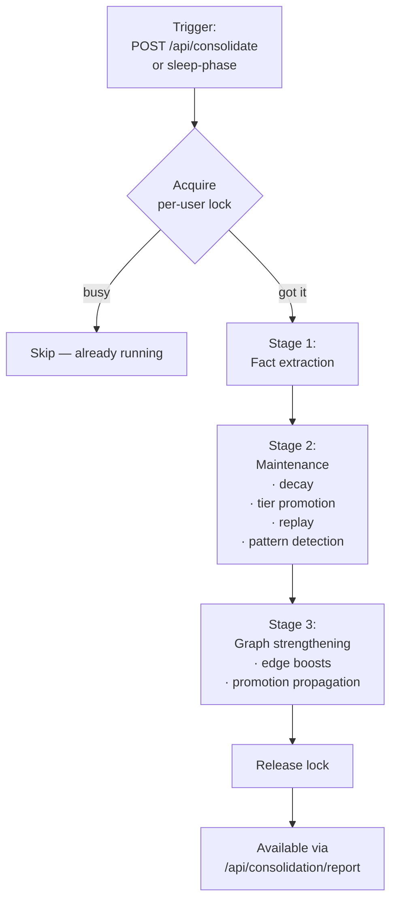

# Consolidation

Consolidation is veld's background maintenance pipeline. It runs as a detached
`tokio::task` (so it survives the 60s HTTP timeout) and does three things:

1. **Fact extraction** — distill raw memories into structured semantic facts.
2. **Maintenance** — replay important memories, consolidate tiers, apply decay.
3. **Graph strengthening** — apply Hebbian edge boosts from co-retrieval.



Implementation: [src/handlers/consolidation.rs](https://github.com/Portll/veld/blob/main/src/handlers/consolidation.rs)
+ [src/memory/maintenance.rs](https://github.com/Portll/veld/blob/main/src/memory/maintenance.rs)
+ [src/memory/replay.rs](https://github.com/Portll/veld/blob/main/src/memory/replay.rs).

## Per-user locking

```rust
static CONSOLIDATION_LOCKS: LazyLock<DashMap<String, Arc<Mutex<()>>>>
    = LazyLock::new(DashMap::new);
```

Concurrent consolidation runs for the same user would double-strengthen
edges and waste work. The per-user `try_lock()` returns immediately if a
consolidation is already in progress, and the duplicate request silently
skips.

This pattern is the canonical "per-user serialization" model in veld. New
write paths that mutate shared per-user state should use the same pattern.

## Triggers

- **Manual** — `POST /api/consolidate` kicks off the pipeline.
- **Sleep phase** — `POST /api/consolidation/sleep` runs a deeper replay
  pass for long-term memory formation. Inspired by hippocampal-cortical
  consolidation during sleep.
- **Automatic (planned)** — N-ingest-trigger cadence will fire mini-lint
  passes and consolidation runs after every N memories ingested (see
  [LLM-Wiki Phase 4](https://github.com/Portll/veld/blob/main/CLAUDE.md)).

## Stage 1 — Fact extraction

`SemanticConsolidator::distill_facts()` walks recent memories and emits
structured `SemanticFact` records (`subject`, `predicate`, `object`, plus
provenance). Fact extraction uses LLM prompting where the `llm-parser`
feature flag is enabled; otherwise it uses rule-based pattern matching.

Extracted facts are stored separately from raw memories in `SemanticFactStore`
and queryable via `/api/facts/*` endpoints.

## Stage 2 — Maintenance

`run_maintenance(decay_factor, user_id, apply_promotions)` performs:

- **Decay** — applies the multi-time-scale decay function from
  [src/decay.rs](https://github.com/Portll/veld/blob/main/src/decay.rs). Anchored memories are exempt.
- **Tier promotion** — checks each memory against `TIER_PROMOTION_*` constants
  and moves it up a tier when criteria are met.
- **Replay** — re-evaluates Hebbian edge candidates among memories that were
  retrieved together since the last consolidation. Returns an `edge_boosts`
  list.
- **Pattern detection** — scans for repeated patterns and writes new
  episode-level summaries.

## Stage 3 — Graph strengthening

The `edge_boosts` from replay are applied to the graph:

```rust
graph.strengthen_memory_edges(&edge_boosts)
    -> (edges_strengthened: usize, promotion_boosts: Vec<...>)
```

`promotion_boosts` are propagated back to the memories — when an edge crosses
a strength threshold, both endpoint memories receive an importance bonus
(`apply_edge_promotion_boosts`).

## Consolidation report

`POST /api/consolidation/report` returns:

- Number of facts extracted in the last run
- Edges strengthened
- Memories promoted between tiers
- Decay deltas
- Duration

This is the closest existing primitive to a "lint" pass. The LLM-Wiki plan
extends it (Phase 4) with orphan detection, contradiction surfacing, stale-
derived-page detection, and file-cite-missing checks.

## Gap topology — what's missing

[`src/memory/gap_topology/`](https://github.com/Portll/veld/tree/main/src/memory/gap_topology)
runs alongside consolidation. It uses Voronoi decomposition over the graph
to identify *gaps* — entity neighbourhoods with sparse coverage. Gap
findings can surface to the agent as "you should ask the user about X"
hints, or simply rank future ingest priorities.

## See also

- [Memory tiers](memory-tiers.md) — what the tier promotion writes
- [Knowledge graph](knowledge-graph.md) — what edge strengthening touches
- [Intent log](intent-log.md) — consolidation events are also journalled
