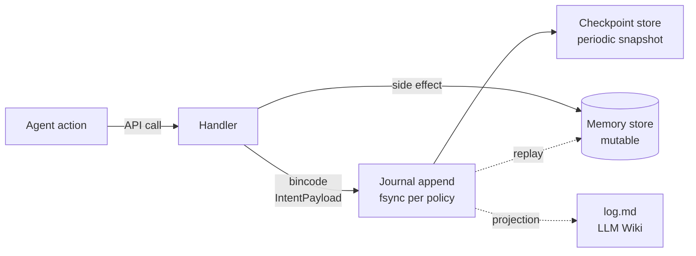

# Intent log

The intent log is veld's event-sourced journal of agent actions. Every
agent operation — `remember`, `recall`, `reinforce`, `anchor`, `tier_move`,
`forget` — emits a typed `IntentPayload` event, bincode-encoded and
appended to the log.

The arrows from journal to memory store and wiki are *projections* — the
log is canonical; everything else is derived state that can be rebuilt.

Implementation: [`src/intent_log/`](https://github.com/Portll/veld/tree/main/src/intent_log).

| File | Role |
|---|---|
| `mod.rs` | Public API; `IntentLog` type |
| `header.rs` | Log file header with version + checksum |
| `journal.rs` | Append-only writer; rotation; fsync policy |
| `payload.rs` | Typed `IntentPayload` enum with bincode codec |
| `projection.rs` | Project events back into memory state (replay) |
| `checkpoint_store.rs` | Periodic snapshot of derived state for fast replay |
| `migrations.rs` | Schema-version migration for old log files |

## Why event-sourced?

The memory store is mutable — memories grow more important, decay, get
forgotten. The intent log is the **single ground truth** for what an agent
actually *did*, independent of what the memory store currently shows.

This matters for:

- **Audit:** "did the agent ever access memory X?" — grep the intent log.
- **Replay:** "rebuild the memory store from scratch as of timestamp T"
  — replay the intent log up to that point.
- **Drift detection:** if the memory store and intent log diverge, something
  silently corrupted the store. The log wins.
- **Time-coherent projection (LLM-Wiki):** the wiki's `log.md` is a direct
  projection of the intent log. Time-coherence between veld and the wiki
  is built-in because the log is the canonical timeline.

## Payload shape

`IntentPayload` is the canonical typed enum (see
[`src/intent_log/payload.rs`](https://github.com/Portll/veld/blob/main/src/intent_log/payload.rs)).
Bincode encoding gives us compact, forward-compatible serialization with
schema-version checks on read.

Recent work (commit `3173a16`) made the payload fully typed — previously it
was a JSON blob. The transition is part of the v0.8 stabilization.

## See also

- [Consolidation](consolidation.md) — also emits events to the log
- [Decision 0002](../decisions/0002-llm-wiki-dual-pathway.md) — how the log
  underwrites wiki time-coherence
