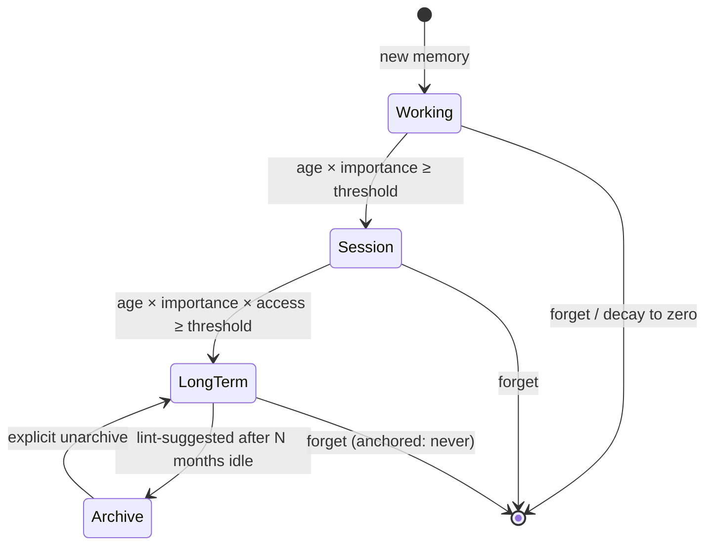

# Memory tiers

Veld implements a 4-tier memory model based on cognitive-science models of
human memory (working / session / long-term / archive). Tier determines
retrieval cost, decay rate, and which scoring signals dominate.



```rust
pub enum MemoryTier {
    Working,    // Cowan's focus-of-attention; immediate context
    Session,    // Current task / session
    LongTerm,   // Consolidated durable memories
    Archive,    // Compressed; surfaced only on explicit query
}
```

(See [`src/memory/types.rs`](https://github.com/Portll/veld/blob/main/src/memory/types.rs).)

## Tier characteristics

| Tier | Retrieval | Decay rate | Promotion criteria |
|---|---|---|---|
| Working | Brute-force cosine scan (Layer 3.5) | Fast | New memories enter here |
| Session | Brute-force cosine scan (Layer 3.5) | Medium | Promoted from Working after `TIER_PROMOTION_WORKING_AGE_SECS` if importance ≥ threshold |
| LongTerm | HNSW + graph spreading + cross-encoder | Slow (Fourier-learned per-type) | Promoted from Session after `TIER_PROMOTION_SESSION_AGE_SECS` if importance ≥ threshold |
| Archive | HNSW only, excluded from default queries | None (or very slow) | Lint-suggested after N months of zero access; agent or operator approval |

Constants live in [src/constants.rs](https://github.com/Portll/veld/blob/main/src/constants.rs).

## Promotion mechanics

Tier promotion happens during consolidation maintenance
([src/memory/maintenance.rs](https://github.com/Portll/veld/blob/main/src/memory/maintenance.rs)).
For each memory, the maintenance pass computes:

- `age` — time since `created_at`
- `importance` — current importance value (subject to decay and anchor)
- `access_count` — log-scaled retrieval frequency

If the combined score crosses the threshold for the next tier, the memory
moves. Promotion is sticky — a memory rarely drops back to a lower tier
unless explicitly demoted by the agent.

## Agent-directed tier moves

Agents can force a tier transition without waiting for the threshold:

```
POST /api/memory/tier
{
  "user_id": "claude-code",
  "memory_id": "...",
  "target_tier": "LongTerm"
}
```

This is useful when the agent knows a memory is important (e.g., the user
just stated a strong preference) and doesn't want to wait for the
maintenance pass to promote it.

## Anchor — decay resistance

Anchored memories resist decay regardless of access pattern. Use this for
long-lived facts (user preferences, project invariants):

```
POST /api/anchor
{
  "user_id": "claude-code",
  "memory_id": "..."
}
```

Anchored memories are also less likely to be archived by lint suggestions.

## Archive tier — when memories sleep

The Archive tier exists for memories that are *probably* not relevant to
current queries but might be needed for historical lookup. Archived
memories:

- Are excluded from the default `recall` queries.
- Are still indexed in HNSW so explicit "search archive" queries find them.
- Are not consolidated further.
- Have their embeddings retained but content may be compressed.

Promotion to Archive is lint-suggested (see
[Consolidation](consolidation.md)) and either auto-applied or
operator-approved depending on configuration.

## See also

- [Consolidation](consolidation.md) — when and how memories move between tiers
- [Retrieval pipeline](retrieval.md) — how tier affects which scoring layer fires
- [Storage](storage.md) — what's behind the tiers physically
