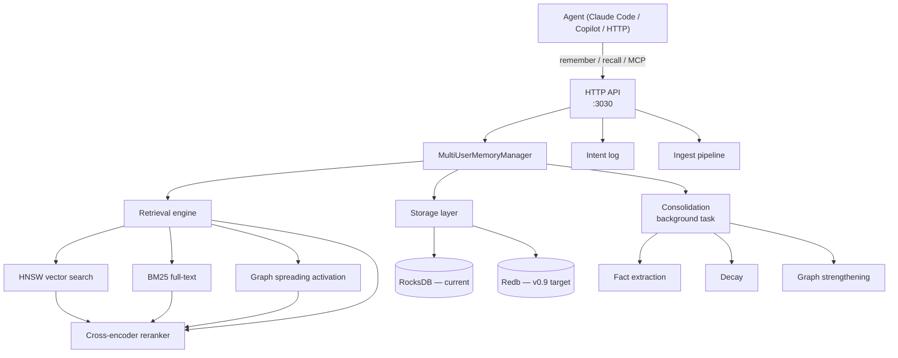

# Architecture overview

Veld is a single-binary edge-native memory system. This page describes the major subsystems and how they fit together.

## Retrieval

Retrieval is the hot path. The pipeline is multi-layer hybrid search — no single algorithm dominates.

### Layers (simplified)

| Layer | Mechanism | Blend |
|---|---|---|
| 3.5 | Dual-embedder scan (MiniLM 384d + Nomic 768d, max-score merge) | 100% of Working/Session tier |
| 4 | BM25 full-text via Tantivy | Combined with vector scores |
| 4.527 | BM25 specificity discount (high BM25, zero entity overlap → 5% penalty) | Modifier |
| 4.92 | Interference detection (pairwise semantic opposition, demote older) | Modifier |
| 5 | 20-signal composite score | Final ranking |
| 5.3 | Cross-encoder reranker | 18% blend, top-20 budget |
| 5.9 | Focal-entity recency scan | Fallback for entity queries |

### 20 scoring signals (overview)

The composite score is built from 20 signals per memory. Categories:

| Category | Signals |
|---|---|
| **Similarity** | Base vector similarity (1), entity match (14), tag match (15) |
| **Time** | Recency (2), temporal match (5), session boost (6), sequence proximity (19) |
| **Affect** | Arousal (3), emotional valence intensity (18) |
| **Source** | Source credibility (4), source-type multiplier (17) |
| **Usage** | Access count (7), feedback momentum (11), importance (13) |
| **Graph** | Graph edge strength / Hebbian (8), episode coherence (16) |
| **Confidence** | Calibrated confidence (9), confidence observations (10) |
| **Rerank** | Cross-encoder (12) |
| **External** | Sleight dimension aggregate (20) |

For per-signal definitions, computation, and blend weights, see
[Retrieval pipeline → The 20 scoring signals](retrieval.md#the-20-scoring-signals).

Signal attribution is tracked per memory so adaptive weight learning can reinforce which signals predicted relevance for a given query type.

## Storage

The storage layer is abstracted behind `PrimaryMemoryStore`, `GraphStore`, and `KeyValueStore` traits in `src/storage/mod.rs`.

**Current runtime backend**: RocksDB (via `src/storage/legacy_rocksdb.rs`).

**Target backend (v0.9)**: Redb — a single-file embedded database with no C dependency, matching veld's "runs offline" identity.

New code should target the trait surface, not the RocksDB concrete types, to land ready for the cutover.

## Memory model

A `Memory` has:

- **Content** — raw text, embedded as 384d (MiniLM) + optionally 768d (Nomic) vectors.
- **Tier** — `Working → Session → LongTerm → Archive`. Promoted by age × importance × access count. Agent-directed moves via `POST /api/memory/tier`.
- **Facets** — `Who`, `What`, `When`, `Where`, `Why`, `RecordKind`, `ContentKind`, `CausalLink`, `EngramBinding`, `Prediction`, `AgentRef`, `Place`. These structure the memory for graph-based retrieval.
- **Calibrated confidence** — Bayesian α/β pair. Retrieval gate at 0.85–1.0 prevents low-confidence memories from polluting results.
- **Decay** — multi-time-scale per `src/decay.rs`. Fourier-learned decay scales per memory type.
- **Anchor** — agent-pinned memories resist decay (`POST /api/anchor`).

## Consolidation

Consolidation runs as a background `tokio::task` (survives the HTTP timeout). It has three stages:

1. **Fact extraction** — distill raw memories into structured facts.
2. **Maintenance** — replay important memories, consolidate tiers, apply decay.
3. **Graph strengthening** — Hebbian edge boost: memories recalled together get stronger edges.

Per-user `CONSOLIDATION_LOCKS` prevent concurrent consolidation from racing.

Sleep-phase consolidation (`POST /api/consolidation/sleep`) runs a deeper replay pass for long-term memory formation.

## Ingest

The ingest pipeline accepts multi-format content:

- Plain text, markdown, PDF (behind `pdf` feature flag)
- GitHub repository contents
- Google Drive documents
- Project seed (`POST /api/seed`) — cold-start bulk ingestion

## Intent log

The intent log (`src/intent_log/`) is an append-only event-sourced journal. Every `remember`, `recall`, and agent action produces a typed `IntentPayload` encoded with bincode. The log is the ground truth for what an agent did, independent of the memory store state.

## Auth

- **API-key middleware** (`src/auth.rs`) — all routes except `/health/*` require a valid key.
- **User auth (Phase C)** — password + TOTP + recovery codes at `/api/user_auth/*`.

## Multi-tenancy and Zenoh

- **Multi-tenant** (`src/extensions/`, `multi-tenant` feature) — hosaka collective store, PII policy, per-tenant maintenance.
- **Zenoh transport** (`src/zenoh_transport/`, `zenoh` feature) — ROS2/robotics pub/sub for edge-device swarms.

## Alignment

Cross-embedder alignment — `Procrustes` + `Ridge` fitters — maps MiniLM-space vectors into Nomic-space before merging scores, so dual-embedder max-score merge is meaningful. Binaries: `alignment-collect`, `alignment-fit`, `alignment-eval` in `src/bin/`.

---

## See also

| Subsystem | Page |
|---|---|
| Retrieval pipeline (20 signals, hybrid search) | [Retrieval pipeline](retrieval.md) |
| Storage backends (Redb/RocksDB), trait surface | [Storage](storage.md) |
| 4-tier model (Working/Session/LongTerm/Archive) | [Memory tiers](memory-tiers.md) |
| Background consolidation (fact extraction, replay, Hebbian) | [Consolidation](consolidation.md) |
| Multi-format ingest, webhooks, project seed | [Ingest](ingest.md) |
| Event-sourced journal (`IntentPayload`) | [Intent log](intent-log.md) |
| Hebbian edges + spreading activation | [Knowledge graph](knowledge-graph.md) |
| Cross-embedder alignment (Procrustes + Ridge) | [Alignment](alignment.md) |
| Top-level Rust module map | [Module index](module-index.md) |

For everything else, the sidebar lists every page.
