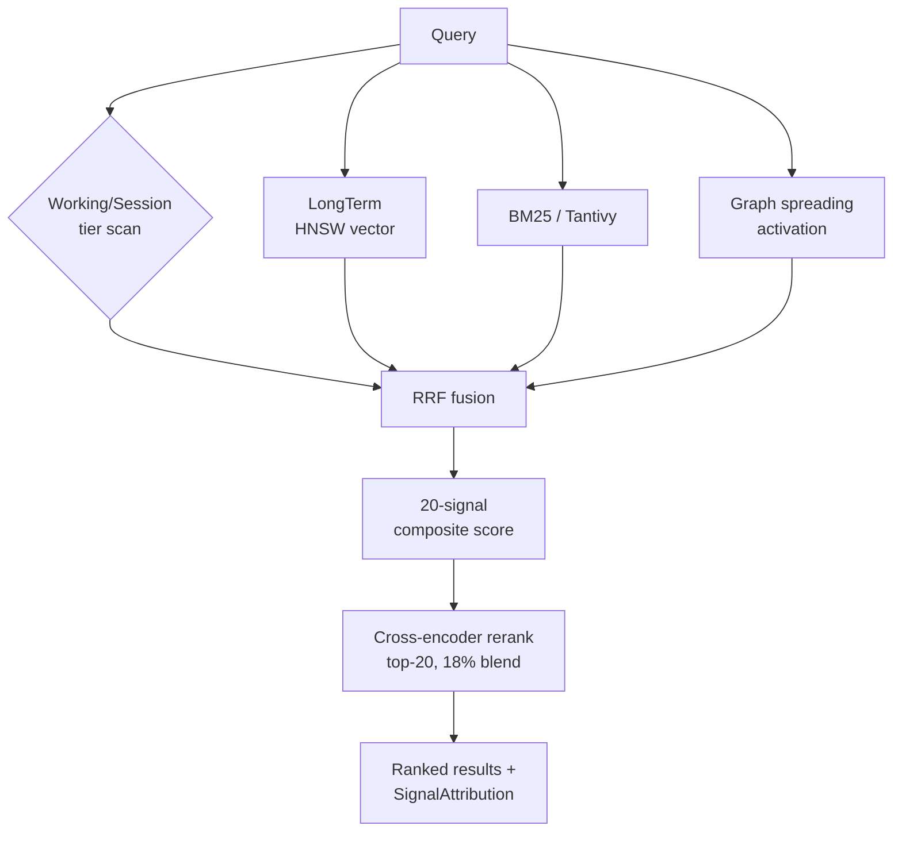

# Retrieval pipeline

Retrieval in veld is multi-layer hybrid search. No single algorithm dominates;
the pipeline composes BM25 keyword matching, dual-embedder vector similarity,
Hebbian graph spreading activation, and cross-encoder reranking into a single
20-signal composite score.

## The layers

The pipeline is implemented in `src/memory/recall.rs`, `src/memory/retrieval.rs`,
and `src/memory/hybrid_search.rs`. Layer numbers are non-integer in places
(4.527, 4.92, 5.85) because layers were inserted between earlier ones during
development — the labels survive in the code as anchors for the
[PROGRESS.md](https://github.com/Portll/veld/blob/main/PROGRESS.md) history.

| Layer | Mechanism | Purpose |
|---|---|---|
| 3.5 | Working + Session tier brute-force cosine scan | Root cause fix for temporal MRR — recent memories were missed by HNSW |
| 3.5 | Dual-embedder max-score merge (MiniLM + Nomic) | Best of two embedders per memory |
| 4 | BM25 full-text via Tantivy | Keyword-match component |
| 4.527 | BM25 specificity discount | High-BM25 + zero-entity-overlap → 5% penalty |
| 4.92 | Interference detection | Pairwise semantic opposition; demote older of two contradictory memories |
| 5 | 20-signal composite score | Final ranking |
| 5.3 | Cross-encoder reranker | 18% blend, top-20 budget |
| 5.85 | Linguistic boost (moved before ordinal pins) | Reorder for query-intent fit |
| 5.87 | Calendar-aware temporal range demotion | "Last week" sweet spot — demote memories too far inside or outside the window |
| 5.9 | Focal-entity recency scan (Strategy E) | Fallback when explicit entity queries are starved |

## The 20 scoring signals

The composite score in Layer 5 is built from 20 signals per memory. They live
in `ScoringSignals` ([src/memory/types.rs](https://github.com/Portll/veld/blob/main/src/memory/types.rs)).
Each signal is described below — what it measures, how it's computed, why it
matters. Weight percentages, where listed, are the blend coefficient in the
final composite. Signals without an explicit weight participate through the
RRF fusion or scoring layer.

### Base vector similarity

**Function:** Cosine similarity between the query embedding and the memory embedding, fused via [Reciprocal Rank Fusion](https://en.wikipedia.org/wiki/Reciprocal_rank_fusion) across the dual embedders (MiniLM 384d + Nomic 768d).
**Benefit:** Foundation ranking signal — every other signal modulates or refines this base. Without it, semantically-related memories can't surface at all; with it alone, the ranking is just "closest meaning wins".

### Recency (exponential decay)

**Function:** `exp(-0.01 × hours_old)` applied to the memory's `created_at`. Half-life roughly 70 hours.
**Benefit:** Bias retrieval toward what just happened. Counteracted by anchoring and Hebbian reinforcement so important old memories aren't lost — but on a tie, the more recent memory wins.

### Arousal / emotional intensity

**Function:** Pulled from `WhereFacet.source.emotional.arousal` (0.0–1.0). Set at ingest by the agent or inferred from content tone.
**Benefit:** Mimics human memory's bias toward emotionally charged events. Urgent, surprising, or significant moments rank higher than neutral routine.

### Source credibility

**Function:** Continuous score (0.0–1.0) from `WhereFacet.source.credibility` — how trustworthy this memory's origin is.
**Benefit:** A user-direct statement should outrank a speculative agent inference even when both match the query semantically. This signal carries that trust ordering.

### Temporal match (query time vs. memory timestamp)

**Function:** When the query has an explicit time reference ("last week", "yesterday", a date), scores how well the memory's `created_at` falls inside the implied window. Max contribution 0.25.
**Benefit:** Time-scoped queries actually return time-scoped results. Without this, a perfect-match memory from two years ago can beat a relevant one from last Tuesday.

### Session boost (same-session memories rank higher)

**Function:** Fixed `+0.03` boost when the memory's `created_at` is within the last 2 hours of query time.
**Benefit:** Cheap "currently-thinking-about-this" prior. Prevents an old similar memory from dominating context fresh from this session.

### Access count (log-scaled, 7%)

**Function:** `ln(1 + access_count) / 5.0`, capped at 1.0. The implicit-feedback channel — every successful recall increments the counter.
**Benefit:** Memories the agent actually uses rise to the top. The log dampens the effect so a memory recalled once doesn't lose much to one recalled fifty times — popularity doesn't crush relevance.

### Graph edge strength (Hebbian, 8%)

**Function:** Strongest Hebbian edge weight from this memory to any memory currently in the result set (or to the entities the query mentions). Edges strengthen during [consolidation](consolidation.md) when memories are co-retrieved.
**Benefit:** "Neurons that fire together, wire together." Memories that have historically surfaced together do so again — surfaces conceptual clusters that pure vector similarity misses. See [src/memory/graph_retrieval.rs](https://github.com/Portll/veld/blob/main/src/memory/graph_retrieval.rs).

### Calibrated confidence (Bayesian α/β gate at 0.85–1.0)

**Function:** Each memory tracks a Beta-distribution α/β pair representing "confirmed vs. contradicted" observations. The gate filters out memories below 0.85; memories above 1.0 get a top-of-band boost.
**Benefit:** Hallucinations and low-evidence guesses don't pollute factual recall, but high-evidence facts get amplified. The α/β model gracefully updates as feedback arrives.

### Confidence observations

**Function:** Total count of α + β — how many feedback events have shaped this memory's calibration.
**Benefit:** Loosens the gate for memories with very few observations (their calibration is unreliable, so give them benefit of the doubt). Tightens it for mature, well-observed memories. Without this, a fresh memory with zero observations would always look maximally uncertain.

### Feedback momentum (EMA from user reinforcement)

**Function:** Exponential moving average over `POST /api/reinforce` signals (or implicit clicks / dismissals). Range -1.0 to 1.0. EMA half-life roughly one week.
**Benefit:** Tracks *direction of trust over time*. A memory the user consistently endorses accumulates positive momentum; consistently rejected ones decay faster. The EMA smooths noise so a single off-day doesn't bury good memories.

### Cross-encoder score (18% blend)

**Function:** Bi-directional attention model that scores query-memory pairs *jointly* (not independently). Reranks the top-20 from cheap layers; blended at 18%.
**Benefit:** Cheap layers (vector + BM25) score independently and miss subtle relevance. Cross-encoder catches what bi-encoders can't — but is slow, so blends into the final score rather than dominating it. See [src/embeddings/cross_encoder.rs](https://github.com/Portll/veld/blob/main/src/embeddings/cross_encoder.rs).

### Importance (agent-set or inferred)

**Function:** Agent's explicit importance value (`remember(importance=0.8)`) or inferred from facets (high arousal + high credibility → high importance). Anchored memories carry the maximum.
**Benefit:** Most influential agent-controllable lever. Tells the system "this matters more than its cosine score suggests" — invariants, preferences, decisions ride this signal.

### Entity match

**Function:** Cosine-like overlap between entities the query mentions and entities attached to this memory (`WhoFacet`, `WhereFacet.place`, etc.). Surfaced through the entity-resolution pipeline (`/api/entity/resolve`).
**Benefit:** A query naming "Alice and Project Atlas" boosts memories about both, even if their embeddings aren't a tight match. Catches entity-pinned relevance that semantic-only retrieval misses.

### Tag match

**Function:** Overlap between active context's tags and the memory's tags. Tags are the cheap "what kind of thing" signal — `auth`, `bug`, `decision`, `preference`.
**Benefit:** Lower-precision than entity match but cheaper and broader. When the agent is in "thinking about auth" mode, all auth-tagged memories get a small lift. The kitchen-sink lower-bound for relevance.

### Episode coherence (8%)

**Function:** Memories encoded in the same session or sharing an `EngramBinding` facet get a coherence boost when retrieved together.
**Benefit:** Preserves episodic structure. If you ask about a specific debugging session, all memories from that session surface together rather than getting scattered by independent ranking. Mirrors how humans recall events as bundles.

### Source-type multiplier

**Function:** Categorical multiplier on credibility (signal 4) by source-type tag: `User` (×1.0), `Agent` (×0.8), `Document` (×0.7), `Unknown` (×0.5).
**Benefit:** Two memories with the same raw credibility score are treated differently based on origin. A "user said" 0.7 outranks a "document said" 0.7 because human direct input is generally more authoritative than scraped material.

### Emotional valence intensity (2%)

**Function:** Beyond arousal (signal 3), measures *direction-aware* emotional weight — a strongly positive or strongly negative memory ranks higher than a neutral one of equal arousal.
**Benefit:** Surfaces breakthroughs and failures over forgettable routine. The agent reaching back to "what went well last time" or "what went wrong" finds those memories preferentially.

### Sequence proximity (2%)

**Function:** Boosts memories stored in close temporal sequence to others surfacing for the same query. If memory A was stored at 14:23 and memory B at 14:24, and both are relevant, the pair surfaces together.
**Benefit:** Catches conversational / causal chains that aren't bound to the same session window. Two memories about consecutive events lift each other even when individual scores are mid-range.

### External Sleight dimension aggregate

**Function:** Five topological-health scores pushed by Sleight via `POST /api/sleight/dimensions`: **density** (entity density), **coherence** (semantic coherence of neighbours), **closure** (fraction of triangles closed), **confidence** (average edge confidence), **isotropy** (directional balance). Geometric mean modulates rank when scores are fresh (< 1 hour old).
**Benefit:** Memories from well-mapped, high-confidence regions of the knowledge graph outrank memories from sparse, incoherent regions. Lets an external evaluator (Sleight) exert fine-grained influence on retrieval without veld having to compute topology itself.

---

Each retrieval records [`SignalAttribution`](https://github.com/Portll/veld/blob/main/src/memory/types.rs)
per result — which signals fired, by how much. This feeds adaptive weight
learning over time: if a signal consistently predicts user-confirmed
relevance, its weight can be increased; if it consistently misleads, it
can be discounted.

## Dual-embedder competition

Veld runs two embedders concurrently:

- **MiniLM-L6-v2** (384d, primary) — via ONNX or HTTP endpoint
- **Nomic Embed Text v1.5** (768d, secondary) — via LM Studio / Ollama / vLLM
  HTTP endpoint

The `CompetitiveEmbedder` ([src/embeddings/](https://github.com/Portll/veld/tree/main/src/embeddings))
wraps both as `Arc<dyn Embedder>`. Vector similarity is the max of the two
similarities per memory — every memory wins on its best embedder.

Cross-embedder alignment ([Procrustes + Ridge](alignment.md)) maps the two
spaces into a comparable frame before max-merging; without alignment the
scores would be incomparable.

## Cross-encoder reranking

The cross-encoder ([src/embeddings/cross_encoder.rs](https://github.com/Portll/veld/blob/main/src/embeddings/cross_encoder.rs))
is a more expensive bi-directional model that scores (query, memory) pairs
jointly. Bi-encoders (the standard vector search) score query and memory
independently — fast but less accurate. Cross-encoders score them together —
slow but accurate. Veld blends the cross-encoder score at 18% over the top
20 candidates from the cheap layers.

## Graph spreading activation

Hebbian edges between memories ([src/memory/graph_retrieval.rs](https://github.com/Portll/veld/blob/main/src/memory/graph_retrieval.rs))
strengthen when memories are recalled together. During retrieval, a
high-scoring memory propagates activation along its edges; neighbours of
high-scoring memories get a graph-strength boost (signal 8 above).

## See also

- [Storage](storage.md) — what's behind the retrieval engine
- [Memory tiers](memory-tiers.md) — which memories live in Working vs Session
  vs LongTerm vs Archive
- [Consolidation](consolidation.md) — how Hebbian edges actually strengthen
- [Alignment](alignment.md) — Procrustes + Ridge for the dual-embedder space
