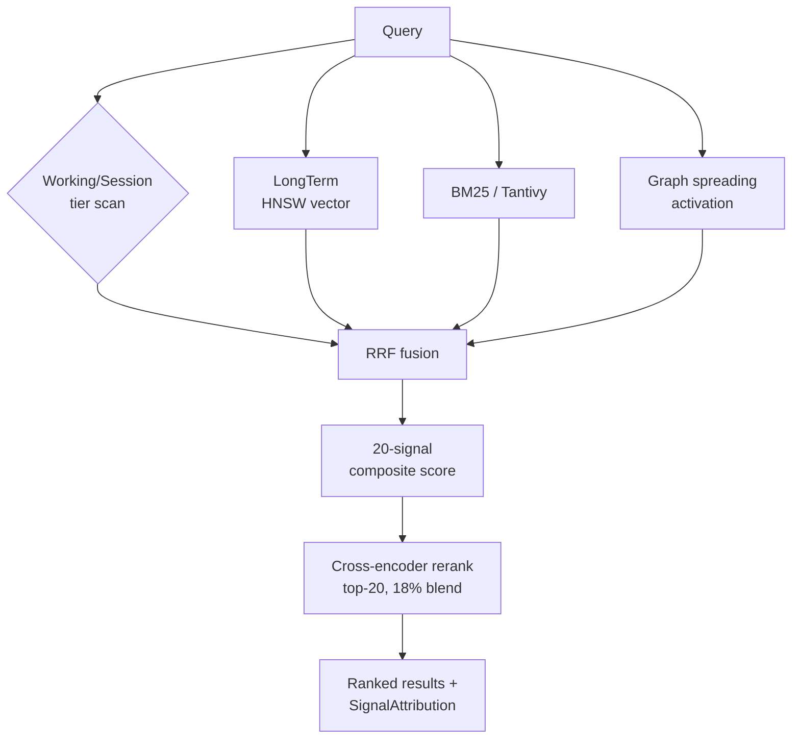

# Retrieval pipeline

Retrieval in veld is multi-layer hybrid search. No single algorithm dominates;
the pipeline composes BM25 keyword matching, dual-embedder vector similarity,
Hebbian graph spreading activation, and cross-encoder reranking into a single
20-signal composite score.

## The layers

The pipeline is implemented in `src/memory/recall.rs`, `src/memory/retrieval.rs`,
and `src/memory/hybrid_search.rs`. Layer numbers are non-integer in places
(4.527, 4.92, 5.85) because layers were inserted between earlier ones during
development — the labels survive in the code as anchors for the
[PROGRESS.md](https://github.com/Portll/veld/blob/main/PROGRESS.md) history.

| Layer | Mechanism | Purpose |
|---|---|---|
| 3.5 | Working + Session tier brute-force cosine scan | Root cause fix for temporal MRR — recent memories were missed by HNSW |
| 3.5 | Dual-embedder max-score merge (MiniLM + Nomic) | Best of two embedders per memory |
| 4 | BM25 full-text via Tantivy | Keyword-match component |
| 4.527 | BM25 specificity discount | High-BM25 + zero-entity-overlap → 5% penalty |
| 4.92 | Interference detection | Pairwise semantic opposition; demote older of two contradictory memories |
| 5 | 20-signal composite score | Final ranking |
| 5.3 | Cross-encoder reranker | 18% blend, top-20 budget |
| 5.85 | Linguistic boost (moved before ordinal pins) | Reorder for query-intent fit |
| 5.87 | Calendar-aware temporal range demotion | "Last week" sweet spot — demote memories too far inside or outside the window |
| 5.9 | Focal-entity recency scan (Strategy E) | Fallback when explicit entity queries are starved |

## The 20 scoring signals

The composite score in Layer 5 is built from 20 signals per memory. They live
in `ScoringSignals` ([src/memory/types.rs](https://github.com/Portll/veld/blob/main/src/memory/types.rs)):

1. **Base similarity** — RRF fusion of BM25 + vector
2. **Recency** — exponential decay by age
3. **Arousal** — emotional intensity from the source event
4. **Source credibility** — from `WhereFacet.source.credibility`
5. **Temporal match** — query-time vs memory-time overlap
6. **Session boost** — within current session window (last 2h)
7. **Access count** — log-scaled retrieval frequency (7% weight)
8. **Graph strength** — Hebbian edge weight (8% weight)
9. **Calibrated confidence** — Bayesian α/β gate, 0.85–1.0
10. **Confidence observations** — total feedback count (gating)
11. **Feedback momentum** — EMA over user reinforcement (-1.0 to 1.0)
12. **Cross-encoder** — bi-directional attention score (18% blend)
13. **Importance** — agent-set or inferred from facets
14. **Entity match** — entity overlap with query
15. **Tag match** — tag overlap with context
16. **Episode coherence** — same-session / same-engram boost (8%)
17. **Source-type multiplier** — multiplies credibility by source kind
18. **Emotional valence intensity** — direction-aware arousal (2%)
19. **Sequence proximity** — temporal-adjacency boost (2%)
20. **External Sleight dimensions** — density, coherence, closure, confidence,
    isotropy from `/api/sleight/dimensions` push

Each retrieval records [`SignalAttribution`](https://github.com/Portll/veld/blob/main/src/memory/types.rs)
per result — which signals fired, by how much. This feeds adaptive weight
learning over time.

## Dual-embedder competition

Veld runs two embedders concurrently:

- **MiniLM-L6-v2** (384d, primary) — via ONNX or HTTP endpoint
- **Nomic Embed Text v1.5** (768d, secondary) — via LM Studio / Ollama / vLLM
  HTTP endpoint

The `CompetitiveEmbedder` ([src/embeddings/](https://github.com/Portll/veld/tree/main/src/embeddings))
wraps both as `Arc<dyn Embedder>`. Vector similarity is the max of the two
similarities per memory — every memory wins on its best embedder.

Cross-embedder alignment ([Procrustes + Ridge](alignment.md)) maps the two
spaces into a comparable frame before max-merging; without alignment the
scores would be incomparable.

## Cross-encoder reranking

The cross-encoder ([src/embeddings/cross_encoder.rs](https://github.com/Portll/veld/blob/main/src/embeddings/cross_encoder.rs))
is a more expensive bi-directional model that scores (query, memory) pairs
jointly. Bi-encoders (the standard vector search) score query and memory
independently — fast but less accurate. Cross-encoders score them together —
slow but accurate. Veld blends the cross-encoder score at 18% over the top
20 candidates from the cheap layers.

## Graph spreading activation

Hebbian edges between memories ([src/memory/graph_retrieval.rs](https://github.com/Portll/veld/blob/main/src/memory/graph_retrieval.rs))
strengthen when memories are recalled together. During retrieval, a
high-scoring memory propagates activation along its edges; neighbours of
high-scoring memories get a graph-strength boost (signal 8 above).

## See also

- [Storage](storage.md) — what's behind the retrieval engine
- [Memory tiers](memory-tiers.md) — which memories live in Working vs Session
  vs LongTerm vs Archive
- [Consolidation](consolidation.md) — how Hebbian edges actually strengthen
- [Alignment](alignment.md) — Procrustes + Ridge for the dual-embedder space
